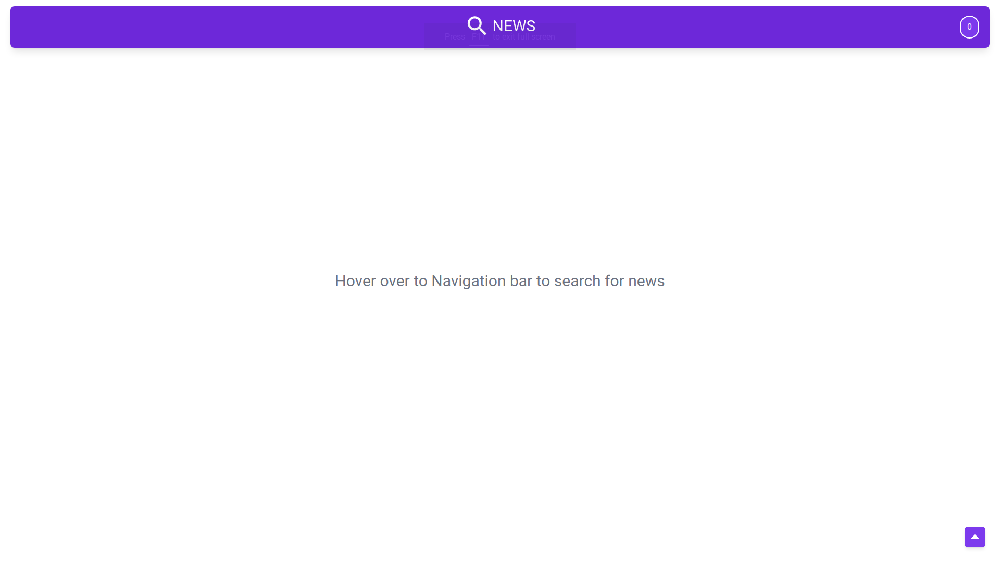
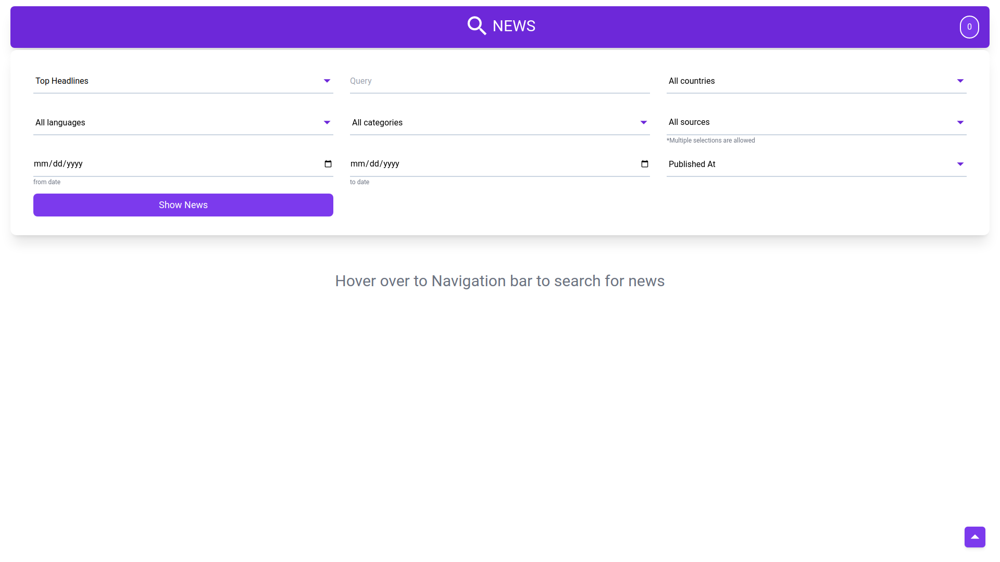
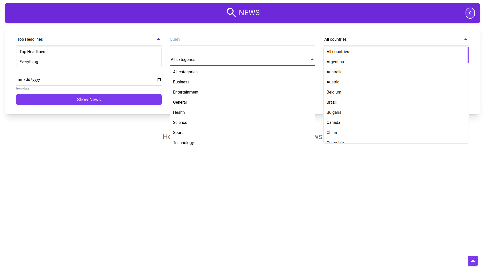
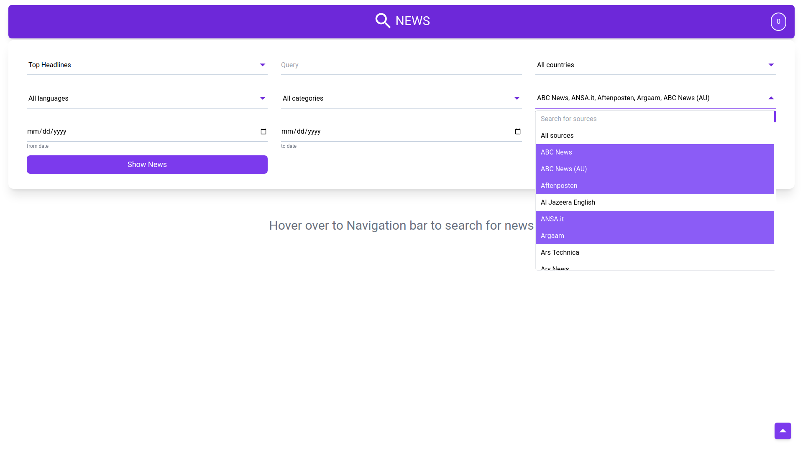
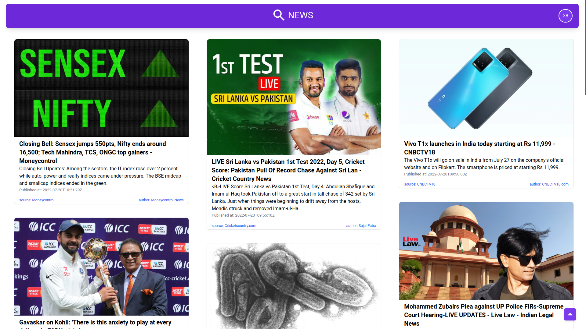

# Show News

## Description

- **Show News** is a single page web application with an attractive and user-friendly UI. The main idea of project is to fetch and display the news based on user inputs in a user-friendly way.
- The application fetches news from [NewsAPI](https://newsapi.org/). The response json file contains articles, each article is displayed to the user in a readable format.
- The news cards have embedded links to the original page to the article.

## Tools used

- [NodeJS](https://nodejs.org/en/) - Node.js is a JavaScript runtime built on Chrome's V8 JavaScript engine.
- [ReactJS](https://reactjs.org/) - A JavaScript library for building user interfaces.
- [tailwindcss](https://tailwindcss.com/) - A utility-first CSS framework packed with classes that can be composed to build any design, directly in your markup.
- [Redux](https://redux.js.org/) - A Predictable State Container for JS Apps
- [Redux-toolkit](https://redux-toolkit.js.org/) - The official, opinionated, batteries-included toolset for efficient Redux development
- [React Spring](https://react-spring.dev/) - A physics based animation library that makes it very easy to create any kind of animation in React application.

## How to install and run the project

1. Install NodeJS from [here](https://nodejs.org/en/download/). It is a javascript runtime that allows running javascript outside of browser.
2. Download or clone the project. Use command `git clone` to clone.
3. `cd` into the project directoy and add a new file named **.env**
4. Create your free account on [NewsAPI](https://newsapi.org/) and grab your api key.
5. Add a line `REACT_APP_NEWSAPI_KEY=paste_your_api_key_here` to .env file.
6. Run these two commands, `npm install`, then `npm start`.
   - `npm install`, this command will install the required dependencies from package.json
   - `npm start`, this command will start the development server on port no. 3000
7. Visit [localhost](http://127.0.0.1:3000/) to view the application.

**Note - React will automatically open up the browser once the developement server is up and running. By default it also adds `.localdomain` to localhost. You need to remove `.localdomain` else you will get error with status code 426 from NewsAPI.**

## How to use the project

- Simple usage, just hover over to the bar at the top, a form will open up. Fill in the search details and click on Show News button.
- 20 news articles got as a response from NewsAPI will show up in a masonry layout.
- Right end of the top bar displays the total the number of results NewsAPI have for you search inputs.
- Only 20 results are requested at a time. Use the Load More button at the bottom to get more results.

## Screenshots

</img>
</img>
</img>
</img>
</img>

## Why not hosted?

The api that is used in this project to get the curated news articles is [NewsAPI](https://newsapi.org/). As per the API's policies, for free accounts the requests are served only if they are coming from the localhost. Hence the application hosted with an api key belonging to free account won't display any results.

## What I learned from this project?

### ReactJS

- Basic syntax, folder structure of a React project.
- Storing secret values in React application.
- Hooks in React -
  - `useState` and `useReducer` to store the state of a component.
  - `useEffect` hook that executes when component is rendered or the value of dependencies change.

### TailwindCSS

- TailwindCSS classes are used to design the UI of application.

### Including animations to the React Application

- [React Spring](https://react-spring.dev/) is used to create animations.
- [react-spring](https://www.npmjs.com/package/react-spring) package needs to be imported to use React spring. The package provides lot of tools that helps creating any kind of physics-based animation.
- `useSpring`, `useTransition` hooks along with `animated` component are used in this project.

### Redux and Redux-toolkit (RTK)

- Redux is a store that holds the state of application.
- Redux-toolkit (RTK) includes utilities that help simplify many common use cases, including store setup, creating reducers and writing immutable update logic, and even creating entire "slices" of state at once.
- [redux-toolkit](https://www.npmjs.com/package/redux-toolkit) and [react-redux](https://www.npmjs.com/package/react-redux) are the required npm packages to include redux store in react application.
- **redux-toolkit** is used to set-up the store, while **react-redux** provides hooks like `useSelector` and `useDispatch` to access the state variables and dispatch actions to update the state variables.

### Why not prop drilling or useContext?

- There are many state variables so prop drilling isn't a scalable way to store and manipulate the states.
- useContext could be used but the kind of data that needed to be stored in state was frequently changing, like a variable that decides if the form if visible or not.
- This kind of data changes very frequently, which results into unnecessary re-rendering of complete App component.
- Using redux stores reduces this unnecessary re-rendering of components to a greater extent.

## Added features

- **Handy Inputs**

  - User do not need to manually enter any value, that means user does not necessarily have to know the available input options to the fields
  - All the input fields are select input fields, user is provided with all possible values for an input.
  - The select inputs are searchable.
  - User has complete flexibility to the input combinations with no knowledge of API required.

- **Animations**

  - Application have animations, that enhances user experience.

- **Images and direct links**

  - All the fields of an article are used to display news.
  - News is displayed with an image which conveys information better.
  - All the news cards have an embedded links to the original articles.
  - Clicking on the card opens up the full article in new tab.

## Some Issues, yet to be resolved

1. **Illegal input combinations** - Some input combinations are not allowed by NewsAPI, but can be submitted through form. This results in api sending an error response.

   - `<Navform />` component contains a `disabledInputs` array, a state variable, adding an input names to this array will disable it.
   - A logic needs to be implemented that adds and removes appropriate input's names to `disabledInputs` based on value of other inputs. For eg. NewsAPI responds with an error if the country or category input is mixed with sources input, so in application country and category inputs must be disabled if sources input contains some value, and vice versa.

2. **Not yet mobile responsive**
